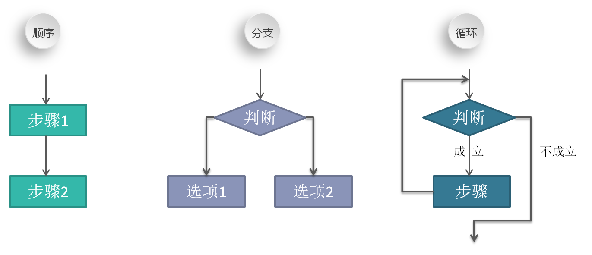
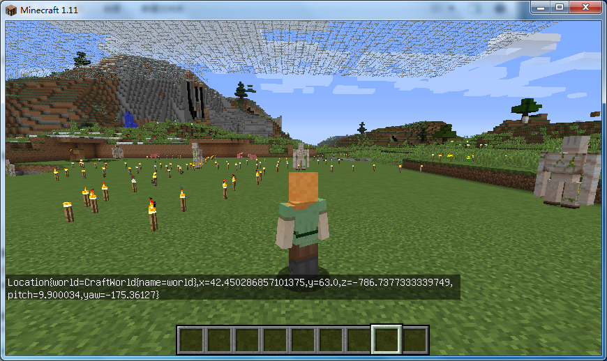
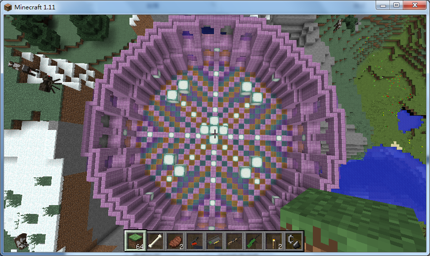

<!-- $theme: gaia -->
<!-- page_number: true -->

# Minecraft 小游戏之旅

---
<!-- *template: invert -->

# 课程目标

* 认识编程
* 学会编程
* 爱上编程

---

# 什么是编程

- ==**简单来说，就是使用计算机语言及一些辅助工具来实现一些能达到的目标**==

---

# 怎么学会它

- ==**那就由老师带领大家，一步一步地，从无到有地，实现至少两个Minecraft小游戏**==

---

# 怎样算爱上

- ==**当大家学完本课程后，明白了编程的思维模式，还能通过自己动手编写出一个独创的Minecraft小游戏，就是爱上它啦**==

---

# 准备工作

1. 在电脑桌面新建一个叫 **Mc入口** 的文件夹。然后，我们就准备安装软件了。要注意的是，安装各个软件的路径中，不要包含非英文字符或标点符号，否则软件可能跑不起来。

---

2. 注册下载并安装最新版本的 [Minecraft客户端](https://www.minecraft.net/zh-hans/)。安装完成后，打开 Minecraft客户端 后，选择 **1.11** 版本作为默认版本。再接着把 **Minecraft客户端** 的启动文件 **MinecraftLauncher** 新建一个快捷方式并重命名为 **启动客户端** ，然后把快捷方式文件移动至桌面文件夹 **Mc入口** 。

---

3. 下载并安装 [jdk1.8.0](https://www.oracle.com/technetwork/java/javase/downloads/jdk8-downloads-2133151.html)。安装完成后，需要配置环境变量。右键选择我的电脑 -> 属性 -> 高级系统设置 -> 环境变量。在 **系统变量** 栏下新建一个 JAVA_HOME 变量。值为安装 jdk 的目录（例如 `D:\myPrograms\jdk`），即 bin 文件夹所在目录。然后，再编辑 Path 变量，若系统是 win10，则添加 `%JAVA_HOME%\bin` 并置顶；若系统是 win7，则在值的开头添加`%JAVA_HOME%\bin;`。完成后，打开 cmd 窗口输入`java -version` 并回车，若窗口输出 Java 版本信息，则说明设置成功了。

---

4. 下载并安装 [Git](https://gitforwindows.org/)。需要注意的是，下面红色箭头指向的选项，一定要选上。否则，鼠标右键菜单就没有 **Git Bash Here** 项，会导致使用不便。


---

5. 声明：由于 **scriptcraft** 的新版本尚未完成，因此我们不能使用最新的 1.13 甚至 1.14 版本的 BuildTools 。而是使用与 **scriptcraft** 相匹配的 1.11 版本的 BuildTools 。
(1) 下载 [BuildTools](https://hub.spigotmc.org/jenkins/job/BuildTools/lastSuccessfulBuild/artifact/target/BuildTools.jar) 准备安装 Spigotmc。具体步骤可参考[BuildTools Wiki](https://www.spigotmc.org/wiki/buildtools/): 先在你的软件安装目录下新建一个 **Spigotmc** 文件夹，然后右击该文件夹，发送快捷方式到桌面并把该快捷方式放入到 **Mc入口** 文件夹中。然后再 BuildTools.jar 文件放入 **Spigotmc** 文件夹中。进入 **Spigotmc** 文件夹中。在空白处右击选择 **Git Bash Here** 打开 Git 窗口。输入命令 `java -jar BuildTools.jar --rev 1.11`，回车并等待即可。
---

【接上页】

(2) 当 BuildTools 安装完成后， 把 **start_server.bat** 文件也放入 **Spigotmc** 文件夹中。双击 **start_server.bat** 运行，则会在 **Spigotmc** 文件夹中生成 **eula.txt** 等文件。打开刚生成的 **eula.txt** 文件，将其中的 `eula=false` 改成 `eula=true` ，否则我们无法真正启动服务器。
(3)然后，右击该 **start_server.bat** 文件，发送快捷方式到桌面。然后把桌面的此快捷方式重命名为 **启动服务器** 放入到 **Mc入口** 目录中。
(4) 这个时候，我们已经可以启动服务器并进行多玩家的游戏了。但是，我们尚不能使用JavaScript来做一些有趣的事情哦。

---

【接上页】

此外，为了方便教学的进行，我们需要设置一下 **server.properties** 文件中的参数。

```yml
# bukkit/spigotmc
level-type=FLAT
generate-structures=false

# creative mode
gamemode=1
pvp=false

# turns off authentication (for classroom environments)
online-mode=false
spawn-npcs=false
spawn-monsters=false
```

---

6. 为了在 Spigotmc 中使用 JavaScript ，我们需要先下载一个插件包 [scriptcraft.jar](https://www.scriptcraftjs.org/) 。然后把该插件包放入到 `Mc入口 > Spigotmc > plugins` 中。重启服务器后，在命令行窗口中输入 `js 1 + 1`，如果输出了数字 **2**，则说明插件安装成功啦。
===
这时候，在 **Spigotmc** 目录中会生成一个叫 **scriptcraft** 的文件夹，以后，我们的一切操作，都会基于该文件夹的内容。右击选择 **scriptcraft** 目录，然后发送快捷方式到桌面并重命名其为 **Js** ，然后再把该快捷方式放入 **Mc入口** 目录中。

---

7. 为了方便编写代码，我们需要下载并安装 [Vscode](https://code.visualstudio.com/)。需要注意的是，下面红色箭头指向的选项，一定要选上。否则，鼠标右键菜单就没有相应的 **Open with Code** 选项，会导致使用不便。


---

8. **JtLkaKill** 用于终止伽卡学生端。该软件不用安装，直接重命名为 **终止伽卡** 放置于 **Mc入口** 文件夹中即可

---

9. 安装 **伽卡他卡电子教室学生端** ，用于被老师控屏。课程结束后，可打开 **JtLkaKill** 终止伽卡，然后把整个伽卡安装的目录删除即可。


到此，我们已经安装了所有必需的软件和插件。

---

# 如何实现Minecraft小游戏

### 1. 编辑地图

我们使用 [WorldEdit](https://dev.bukkit.org/projects/worldedit/files/) 插件来实现[游戏场地的构建](http://mineplugin.org/WorldEdit)

### 2. 编写代码

我们使用 [JavaScript](https://developer.mozilla.org/zh-CN/docs/Web/JavaScript)(后面统一叫 Js) 脚本来实现游戏的逻辑

---

# 让我们一点一滴地积累 Js 基础

---

# 变量

> 变量是存储数据(值)的容器

<small style="font-size: .8em;">在 plugins 文件夹中，我们新建一个 test_variable.js 文件，然后敲下以下代码</small>
```javascript
exports.test_variable = function() {
  var name = 'Echo';
  
  server.broadcastMessage('Hello, ' + name);
}
```

---

# [数据类型](https://developer.mozilla.org/zh-CN/docs/Web/JavaScript/Data_structures)

> 数据，是可以有不同类型的。要检测一个变量的值的类型，可以用 `typeof` 运算符

```javascript
var a = true;	// 这是布尔类型，对应的值有 true 和 false
var b = null;	// 这是空类型，对应的值只有 null
var c = undefined; // 这是未定义类型，指只声明而未赋值的变量
var d = 1;	// 这是数字类型，在js中，整数和小数都是数字类型
var e = 'Echo';	// 这是字符串类型，用单引号或双引号括起来
var f = {	// 这是复合类型之一：对象。
  o: false,
  p: 2,
  q: "str",
};
var g = [3, 'hello', true];	// 这是复合类型之一：数组
```

---

> 如何判断一个值(变量)的数据类型？

很遗憾，Js 没有一个统一的方法来做到这一点。下面我们介绍几种常用的方法：

* `typeof` 操作符

```javascript
typeof true; 		// "boolean"
typeof 'abc';		// "string"
typeof undefined;	// "undefined"
typeof null;		// "object"
typeof 1;		// "number"
typeof { a: 1 };	// "object"
typeof [1, 2, 3];	// "object"
```

<small style="font-size: .75em;">可以看出，`typeof`操作符无法很好地辨别 **null** 及 **数组**。那对于这两种数据类型，我们要如何精确地判断它们呢？【见下页】</small>

---

对于 **null** ，由于将它转换为布尔类型时，其结果为 **false** 。因此，我们可以如此判断：

```javascript
var name = null;
// 结果为 true 则表明 name 的值为 null
typeof name === 'object' && !!name === false;
```

对于 **数组** ，我们则可以使用 **instanceof** 操作符或使用 **Array.isArray** 函数：

```javascript
[1, 2, 3] instanceof Array;		// true
Array.isArray([1, 2, 3]);		// true
```

---

# 注释

> 注释是为了使代码的作用一目了然，是给人看的

<small style="font-size: .8em;">在前一个文件中，我们为代码加入一些注释</small>
```javascript
/**
 * 这个函数的作用是为了输出一些文字
 */
exports.test_variable = function() {
  var name = 'Echo';
  
  // 在这里调用系统函数进行文字输出
  server.broadcastMessage('Hello, ' + name);
}
```

---

# [运算符](https://developer.mozilla.org/zh-CN/docs/Web/JavaScript/Reference/Operators)

> 计算机诞生的目的，就是为了进行数学运算

<small style="font-size: .8em;">我们练习一下以后可能会用到的运算。新建一个 test_operator.js 文件，键入以下代码</small>
```javascript
/**
 * 这个函数的作用是为了输出一些文字
 */
exports.test_operator = function() {
  var number1 = 1;
  var number2 = 2;
  // 在这里，可以把 + 号分别替换成 *、/、- 等
  var result = number1 + number2;
  server.broadcastMessage(result);
}
```

---

【接上一页】

那么，都有哪些[运算符](https://developer.mozilla.org/zh-CN/docs/Web/JavaScript/Reference/Operators)呢？

---

**算术运算符**
| + | - | * | / | % |
|---|---|---|---|---|  -
| 加 | 减 | 乘 | 除 | 求余 |

===

| 表达式 | 结果|
|---|---|
| 1 + 2 | 3 |
| 3 - 1 | 2 |
| 2 * 3 | 6 |
| 6 / 3 | 2 |
| 5 % 3 | 2 |

---

**赋值运算符**
| += | -= | *= | /= |
|---|---|---|---|
| 加等 | 减等 | 乘等 | 除等 |

===
假设 `num = 10;`
| 语句 | num的运算结果 | 等效于 |
|---|---|---|
| num += 2 | 12 | num = num + 2 |
| num -= 2 | 8 | num = num - 2 |
| num *= 2 | 20 | num = num * 2 |
| num /= 2 | 5 | num = num / 2 |

---

**单操作数运算符**
| ++ | -- |
|---|---|
| 自增 | 自减 |

===
假设 `num = 10;`
| 语句 | num的运算结果 | 等效于 |
|---|---|---|
| num++ | 11 | num = num + 1 |
| num-- | 9 | num = num - 1 |

---

**逻辑运算符**
| && | \|\| | ! |
|---|---|---|
| 与 | 或 | 非 |

===

| 表达式 | 结果| # | 表达式 | 结果| # | 表达式 | 结果|
|---|---|---|---|---|---|---|---|
| 0 && 0 | 0 | | 0 \|\| 0 | 0 | | !true | false |
| 0 && 1 | 0 | | 0 \|\| 1 | 1 | | !false | true |
| 1 && 0 | 0 | | 1 \|\| 0 | 1 | | | |
| 1 && 1 | 1 | | 1 \|\| 1 | 1 | | | |
---

# [语句](https://developer.mozilla.org/zh-CN/docs/Web/JavaScript/Reference/Statements)
> 语句，是 Js 运行的基础。通常，简单语句都会以分号 `;` 简单结尾。语句也可以省略分号，但不建议这么做。 
 
简单语句示例：
```javascript
// 声明和赋值语句
var name = 10;

// 函数执行语句
echo('Hello World');

// 自加运算语句
num++;
```

---

除了简单语句，Js 中也存在着大量的复合语句。例如**流程控制**语句。

流程控制只要分三大类，类别如下：



---

**顺序语句**，顾名思义，就是按照从上往下、从左往右顺序执行的语句。
在 plugins 目录下新建一个 test_order.js 文件，然后键入以下代码。保存后，在控制台中执行 `reload` 命令，然后再执行 `/js test_order(self)` 。

```javascript
var Blocks = require('blocks');
var Drone = require('drone');
exports.test_order = function(player) {
  var loc = player.location;
  var drone = new Drone(loc);
  // drone 将会按照顺序创造出 石头、铁、黄金 方块
  drone.fwd(1);
  drone.box(Blocks.stone);
  drone.fwd(1);
  drone.box(Blocks.iron);
  drone.fwd(1);
  drone.box(Blocks.gold);
}
```

---

**分支语句**，即需要先判断条件，再决定执行哪个操作。

分支有两种形式：`if...else` 和 `switch`。其中，`if...else` 主要用于判断逻辑条件；`switch` 主要用于判断计算条件。

---

先来看一下 `if...else` 的用法。

在 plugins 目录下新建一个 test_if_else.js 文件，然后键入以下代码。保存后，在控制台中执行 `reload` 命令，然后再执行 `/js test_if_else(self)` 。

```javascript
exports.test_if_else = function(player) {
  var name = player.name;
  
  if (name.length % 2 === 0) {
    echo(player, 'even');
  } else {
    echo(player, 'odd')
  }
}
```

---

接着，我们看一下 `switch` 的用法

在 plugins 目录下新建一个 test_switch.js 文件。

```javascript
exports.test_switch = function(num) {
  switch (num) {
    case 1:
    	server.broadcastMessage('One'.red());
    	break;
    case 2:
    	server.broadcastMessage('Two'.blue());
    	break;
    case 3:
    	server.broadcastMessage('Three'.green());
    	break;
    default:
    	server.broadcastMessage('Other');
  }
}
```

---

刚才，我们从字符串中使用了颜色方法，从而让文字变得绚丽多彩。那么，Minecraft 都支持哪些颜色呢？


---

继续回到我们的主题。接下来，我们讲一下在任何一门语言中，都是最重要的部分：**循环语句** 

几乎所有的语言，都包括三种类型的循环：`for`、`while`、`do...while`。

它们的区别在哪呢？

---

`for` 用于次数确定的循环。比如，你想生成10只小鸡。

```javascript
var world = server.worlds.get(0);
var entityType = org.bukkit.entity.EntityType.CHICKEN;

exports.test_for = function(player) {
  var loc = player.location;
  
  for (var i = 0; i < 10; i++) {
  	world.spawnEntity(loc, entityType);
  }
}
```

---

`while` 用于判断特定条件的循环。比如，你希望眼前的平地上，同时点着一列炸弹。

在 plugins 目录下新建一个 test_while.js 文件，然后键入以下代码。保存后，在控制台中执行 `reload` 命令，然后再执行 `/js test_while(self)` 。

代码在下一页。

---

```javascript
var Blocks = require('blocks');
var Drone = require('drone');

exports.test_while = function(player) {
    var loc = player.location;
    var drone = new Drone(loc);

    drone.fwd(3);       // 在离自己3格远的地方开始

    while (drone.getBlock().type + '' === 'AIR' && 
    drone.down().getBlock().type + '' !== 'AIR') {    
        drone.up();     // 先上移一格，恢复至原来的位置

        drone.box(Blocks.tnt);  // 放置tnt
        drone.left();          // 然后左移一格
        drone.box(Blocks.fire); // 放火

        drone.right();  // 右移一格，恢复列的位置
        drone.fwd(1);   // 然后，前进一格
    }
}
```

---

`do...while` 与 `while` 相似，但是前者会先执行一次块中的代码。

新建一个 test_do_while.js 文件。然后键入以下代码。保存后，在控制台中执行 `reload` 命令，然后再执行 `/js test_do_while(self)` 。

```javascript
var fireworks = require('fireworks');

exports.test_do_while = function(player) {
  do {
    fireworks.firework(player.location);
  } while(Math.random() > .5);
}
```

---

**其他语句** 

`break;`——用于前面的分支语句和循环语句，目的是为了终结循环，直接执行后面的代码；

`continue;`——用于跳过循环体中本次的执行，即进行下一轮循环。

`exports.~ = ...`——用于输出模块。

`require(...);`——用于引入其他文件模块。

`return ...;`——用于结束当前函数的执行或者返回值。

`;`——只有一个分号表示空语句，没有意义。

---

# [函数](https://developer.mozilla.org/zh-CN/docs/Web/JavaScript/Reference/Functions)

> Js 中，一切皆对象。但函数是头等对象。

在前面的很多例子中，我们都看到了 `function` 这个关键词。之所以需要函数，其实是为了让我们能够重复执行一些代码(注意：这里的重复执行，是指错开时空的执行，和 `for` 语句等只能在同一个时间段内重复执行不是一个概念)。

---

**如何声明并使用一个函数**

1、关键词 function 直接声明
```javascript
function add(num1, num2) {
  return num1 + num2;
}
```
2、声明变量的方式声明
```javascript
var add = function(num1, num2) {
  return num1 + num2;
}
```

如何使用一个声明了的函数
```javascript
add(1, 2);		// 3
```

---

使用函数的示例：**开启生存模式并给予两把剑**

新建一个 test_function.js 文件。然后键入以下代码。保存后，在控制台中执行 `reload` 命令，然后再执行 `/js test_function(self)` 。


```javascript
var ironSword = org.bukkit.Material.IRON_SWORD;
var ItemStack = org.bukkit.inventory.ItemStack;

function giveOnlyOneSword(player) {  
  var swords = new ItemStack(ironSword, 2);
  player.inventory.clear();
  player.inventory.addItem([swords]);
}

exports.test_function = function(player) {
  player.gameMode = org.bukkit.GameMode.SURVIVAL;
  giveOnlyOneSword(player);
}
```

---

学了函数，我们就可以来到一个新的园地—— **递归调用** 。这是所有程序员入门的必经阶段。在前面，我们了解到，一个函数被声明了，我们就可以在别的地方重复调用它。我们没有提及到的是：函数居然还可以在自己的内部调用自己！

下面，让我们用代码解决一个很经典的问题：斐波那契数列求和。

斐波那契数列是这样一个数列：1、1、2、3、5、8、13、21、34... 。可以看到，从第三项起，每项的值，等于前面两项之和。现在的问题是：第 *N* 个斐波那契数列项是多少？

---

我们当然可以利用前面学到的 **循环** 语句来实现：

新建一个 test_fibo_for.js 文件。然后键入以下代码。保存后，在控制台中执行 `reload` 命令，然后再执行 `/js test_fibo_for(8)` ，看看结果是否为 **21** ？

【代码见下页】

---

```javascript
exports.test_fibo_for = function(N) {
  var item1 = 1;
  var item2 = 1;
  var next = 0;
  if (N < 2) {
    return item1;
  }
  for (var i = N; i >= 2; i--) {
    next = item1 + item2;
    item1 = item2;
    item2 = next;
  }
  return item1;
}
```

可以看出，我们需要声明大量的变量来实现它。

---

继续看我们如何用函数 **递归** 来实现这个求项吧：

新建一个 test_fibo_recur.js 文件。然后键入以下代码。保存后，在控制台中执行 `reload` 命令，然后再执行 `/js test_fibo_recur(8)` ，看看结果是否为 **21** ？

【代码见下页】

---

```javascript
function fibo(N) {
  if (N < 2) {
    return N;
  }
  return fibo(N-1) + fibo(N-2);
}

exports.test_fibo_recur = fibo;
```

可以看出，除了参数 N ，我们并没有声明任何的变量。

【注意】**递归** 这个概念，对于编程初学者而言，都是比较绕的。现在并不要求你们掌握，只需要知道有这个概念即可。

---

在前面，我们提到了：*在 Js 中，一切皆对象*。下面，就让我们好好理解 **对象** 到底是什么。

最狭义的对象——用一对花括号括起来一堆属性值。
```javascript
var person = {
  name: 'Echo',
  age: 18,
  gender: 'male',
}

echo(name);	// Error! no name here
echo(person.name);	// Bingo! Echo
```

---

除了可以拥有属性值，对象也可以拥有自己的方法(其实就是键名加上函数)

在 plugins 目录下新建一个 test_object.js 文件，然后键入以下代码。保存后，在控制台中执行 `reload` 命令，然后执行 `/js test_object.printHello()` ，完毕后再执行 `/js test_object.printNameAndAge()`。

```javascript
exports.test_object = {
  name: 'Echo',
  age: 18,
  printHello: function() {
    echo('Hello World!');
  },
  printNameAndAge: function() {
    echo(this.name + ' ' + this['age']);
  },
}
```

---

系统本身也提供了一些有用的对象，例如`self`、`server`、`events` 等。这些对象为我们编码提供了极大的方便。

但为何说在 Js 中*一切皆对象* ？证据就是：`.` 操作符是对象专用的。
```javascript
/**
 * 这里之所以要用到括号，
 * 是因为如果不用括号，
 * 则里面的内容会被认为是操作符，即变量
 */
'hello'.slice(2);	// llo
(5).toString();		// "5"
(true).valueOf();	// "true"
```

---

**数组**，也是一类特殊的对象。生活中，最典型的数组，就是超市或游泳馆中的储物箱：以数字为记号，一个数字标记一个格子，各自里面则可以放各种各样的东西。

这就是数组。

```javascript
var arr = ['Hello World!', 5, { name: 'Echo' }];

arr[0];	// 'Hello World!'
arr[1];	// 5
arr[2];	// { name: 'Echo' }
arr.length;	// 3
```

---

数组拥有大量的[操作方法](https://developer.mozilla.org/zh-CN/docs/Web/JavaScript/Reference/Global_Objects/Array)，以方便开发者对数组进行增删改查。

```javascript
var arr = [2, 4, 6, 8];

arr.push(3);	// [2, 4, 6, 8, 3]
arr.pop();	// [2, 4, 6, 8]
arr.unshift(5);	// [5, 2, 4, 6, 8]
arr.shift();	// [2, 4, 6, 8]
arr.splice(2, 1, 'hi');		// [2, 4, 'hi', 8]
arr.indexOf('hi');		// 2
arr.splice(2, 1);		// [2, 4, 8]
```

---

使用示例：我们可以创建一个**数组**，以方便管理在线的玩家们。每当有一个玩家进入游戏或者离开游戏时，我们可以遍历出当前的在线玩家们的名字。步骤如下。

1、创建一个空数组；
2、监听玩家进入世界事件。当一个玩家进入了当前世界时，就把该玩家的名字放入数组中。然后输出数组中所有玩家的名字。
3、监听玩家离开事件事件。当一个玩家离开了当前世界时，就找到该玩家在数组中的位置，然后根据该位置把相应的玩家名字移除出数组。最后输出数组中所有玩家的名字，以检查结果是否正确。

---

在 plugins 目录下新建一个 test_array.js 文件，然后键入以下代码。保存后，在控制台中执行 `reload` 命令。

```javascript
var arr = [];
events.playerJoin(function(event) {
  arr.push(event.player.name);
  var str = '';
  for(var i = 0; i < arr.length; i++) {
    str = str + ' ' + arr[i];
  }
})
events.playerQuit(function(event) {
  var index = arr.indexOf(event.player.name);
  arr.splice(index, 1);
  var str = '';
  for(var i = 0; i < arr.length; i++) {
    str = str + ' ' + arr[i];
  }
})
```

---

【接上页】

优化后的代码如下：

```javascript
var arr = [];
function printNames() {
  var str = '';
  for(var i = 0; i < arr.length; i++) {
    str = str + ' ' + arr[i];
  }
}
events.playerJoin(function(event) {
  arr.push(event.player.name);
  printNames();
})
events.playerQuit(function(event) {
  var index = arr.indexOf(event.player.name);
  arr.splice(index, 1);
  printNames();
})
```

---

**事件**，是 Js 的安身立命之本。Js 诞生的目的，就是为了对网页表单在提交前进行业务校验，然后提醒用户去修正。其中最关键的就是：程序捕捉到用户的各种操作，然后做出相应的反应。这里，用户的各种操作，就是事件。

---

由于 Minecraft 中存在大量 AI ，因此事件不仅包括玩家做了某些操作（如 挖方块、挨打、移动等），也包括程序自动发生的一些操作（如 鸡下蛋、闪电击中实体、树叶消息等）

Minecraft 中所有的事件，请看[ 这里 ](https://github.com/ZhongyiChen/ScriptCraftStudy/blob/master/SpigotMC%E6%89%80%E6%9C%89%E5%8F%AF%E7%94%A8%E4%BA%8B%E4%BB%B6.md)。

---

**回调**，就是*事件*发生后，需要回过头来调用的*函数*。它本质就是一个函数，只不过放置于事件执行语句中做了其参数。

新建一个 test_event.js 文件。然后键入以下代码。保存后，在控制台中执行 `reload` 命令，然后再尝试着去破坏方块。

```javascript
var sounds = require('sounds');

// 当有方块被破坏时，发出狼嚎
events.blockBreak(function(event) {
  sounds.entityWolfHow(event.block);
});
```

---

`events.blockBreak`事件的回调函数的参数 **event** 对象，也给予了我们阻止事件最终发生的方法。

在 test_event.js 文件中，进行以下修改。保存后，在控制台中执行 `reload` 命令，然后再尝试着去破坏方块。

```javascript
// var sounds = require('sounds');

// 当有方块被破坏时，不发出狼嚎，而是阻止方块被破坏
events.blockBreak(function(event) {
  // sounds.entityWolfHow(event.block);
  event.setCancelled(true);
});
```

<span style="font-size: .8em;">试验结束后，把 test_event.js 文件的内容全部注释掉。</span>

---

上一部分所说的 **事件** ，其实就是 **异步** 的一种。什么叫异步：就是有一些事情，你需要在未来的某个时刻去做。这个时刻，可能是确定的（**定时**），也可能是不确定的（**事件**）。

【代码见下页】

---


新建一个 test_async.js 文件。然后键入以下代码。保存后，在控制台中执行 `reload` 命令，然后再执行 `/js test_async(self)` 。

```javascript
exports.test_async = function(player) {
  setTimeout(function() {
    player.sendTitle(3, ''); 	// 放弃副标题
  }, 1000);
  setTimeout(function() {
    player.sendTitle(2, '');
  }, 2000);
  setTimeout(function() {
    player.sendTitle(1, '');
  }, 3000);
  setTimeout(function() {
    player.sendTitle('Go!', '', 10, 10, 10);
  }, 4000);
}
```

---

Js 的知识点，还有很多很多。多得没个一两年，学不完。

但没关系，根据二八原则，我们只需要把那 20% 的常用知识学好了，也算是入门了。

从现在起，我们会开始编写超过 100 行代码的程序。把前面的各个知识点结合起来，我们就可以干很多事情。

开始吧。

---
<!-- *template: invert -->

# 扔雪球大战

### 我们的第一个小游戏

> 我们扔出去的不是雪球，是对胜利的渴望。

---

**游戏流程：**

1. 玩家输入命令 `/jsp game_snowball_join` 后，程序把玩家昵称放入到一个数组中，以作记录。如果有玩家输入命令 `/jsp game_snowball_leave` 或退出了 Minecraft ，则将玩家昵称移出数组。当参与的玩家达到 4 人后。进入下一个步骤。
2. 四个玩家两两一组，分别给予不同的着装和字符颜色，以示区分。
3. 将不同组的玩家移动到各自的重生地点，每人给予 64 \* 8 个雪球。
4. 给每个玩家分别用小标题提示 'Ready'、'Go' 。游戏时间为 1 分钟。玩家可以开始移动及扔雪球。

---

5. 当雪球扔到敌人身上时，该敌人的位置将遭遇雷击。同时，扔出雪球的玩家所在队伍的 Hit 值会加 1 。
6. 当玩家死亡后，会在出生地点重生。
7. 当距离结束 10 秒前，用倒计时通知所有玩家。
8. 当游戏结束后，用大标题通知玩家是否赢得比赛。
9. 重置所有变量，使得玩家们可以重新进行游戏。

---

> 1. 玩家输入命令 `/jsp game_snowball_join` 后，程序把玩家昵称放入到一个数组中，以作记录。如果有玩家输入命令 `/jsp game_snowball_leave` 或退出了 Minecraft ，则将玩家昵称移出数组。当参与的玩家达到 4 人后。进入下一个步骤。

显然，这里有一个新的知识点。之前，我们都习惯用 `/js` 作为命令的开头。那么，两者的区别究竟是什么呢？

最大的区别就是：执行 `/jsp` 命令不需要执行者拥有管理员权限(被执行过`op`操作)。

---

<span style="font-size:.8em">下面两段程序均是用作打印命令执行者的昵称。</span>

```javascript
/**
 * 在控制台中调用的命令是 /js test_js(self)
 */
exports.test_js = function(player) {
  echo(player, player.name);
}
```

```javascript
/**
 * 在控制台中调用的命令是 /js test_jsp
 */
command('test_jsp', function(parameters, player) {
  echo(player, player.name);
});
```

<span style="font-size:.8em">也就是说，使用`/jsp`程序可以直接获取命令输入者对象。而使用`/js`则需要输入者自己传入一个`self`。</span>

---

现在，让我们正式进入游戏编码。在 plugins 目录下新建一个 game_snowball.js 文件。

创建一个数组用于存储进入游戏的玩家昵称。

```javascript
var names = [];
```

监听输入命令`/jsp game_snowball_join`的用户，将其昵称放入到昵称数组中。
```javascript
command('game_snowball_join',
  function(parameters, player) {
    names.push(player.name);
});
```

---

监听输入命令`/jsp game_snowball_leave`的用户，将其昵称从昵称数组中移除。
```javascript
command('game_snowball_leave',
  function(parameters, player) {
    var index = names.indexOf(player.name);
    names.splice(index, 1);
});
```

同样，直接退出了 Minecraft 的玩家昵称也应该被移除。
```javascript
events.playerQuit(function(event) {
  var index = names.indexOf(event.player.name);
  names.splice(index, 1);
});
```

---

我们的游戏是个两两对决的小游戏。

我们先新增一个变量来指示游戏是否已经开始。

```javascript
var isStarting = false;	// 游戏默认是未开始的
```

我们要在监听玩家输入命令`/jsp game_snowball_leave`的时候，判断已加入游戏的玩家人数，从而决定游戏是否开始。

```javascript
command('game_snowball_join',
  function(parameters, player) {
    names.push(player.name);
    if (names.length === 4) {
      isStarting = true;	// 满 4 人游戏即开始
    }
});
```

---

此外，游戏一旦开始，我们就应该阻止新玩家加入游戏。

```javascript
command('game_snowball_join',
  function(parameters, player) {
    if (isStarting) {
      return;	// return 在这里的作用的结束当前函数的执行
    }
    names.push(player.name);
    if (names.length === 4) {
      isStarting = true;	// 满 4 人游戏即开始
    }
});
```

---

同样，游戏一旦开始，游戏中的玩家就不能够中途退出。

```javascript
command('game_snowball_leave',
  function(parameters, player) {
    if (isStarting) {
      return;
    }
    var index = names.indexOf(player.name);
    if (index > -1) { names.splice(index, 1); }
});

events.playerQuit(function(event) {
  if (isStarting) {
    return;
  }
  var index = names.indexOf(event.player.name);
  if (index > -1) { names.splice(index, 1); }
});
```

---

> 2. 四个玩家两两一组，分别给予不同的着装和字符颜色，以示区分。
 
创建两个新的数组变量用于存储各队伍的玩家昵称。

```javascript
var team_green = [];	// 用于存储绿装玩家
var team_gold = [];	// 用于存储金装玩家
```

---

分组。

```javascript
function makeGroups() {
  for (var i = 0; i < names.length; i++) {
    if (i % 2 === 0) {
      team_green.push(names[i]);
    } else {
      team_gold.push(names[i]);
    }
  }
}
```

---

要给予金装玩家金色套装，给予绿装玩家钻石套装。这里的代码比较复杂。

首先，我们需要在代码顶部引入两个模块。

```javascript
var utils = require('utils');	// 工具函数模块
var slash = require('slash');	// 命令执行模块
```

---

```javascript
function dressGreen(p) {	/* 着绿装 */
  if (p instanceof Array) {  // 如果传进来的是数组
    for (var i = 0; i < p.length; i++) {
      dressGreen(p[i]);
    }
  } else if (typeof p === 'string') {  // 是玩家名称
    dressGreen(utils.player(p));
  } else if (p) {  // 是玩家对象
    p.setOp(true);
    slash(['replaceitem entity ' + p.name 
        +' slot.armor.head minecraft:diamond_helmet',
      'replaceitem entity ' + p.name 
        +' slot.armor.chest minecraft:diamond_chestplate',
      'replaceitem entity ' + p.name 
        +' slot.armor.legs minecraft:diamond_leggings',
      'replaceitem entity ' + p.name 
        +' slot.armor.feet minecraft:diamond_boots'], p);
    p.setOp(false);
  }
}
```

---

哇塞，函数 **dressGreen** 内部竟然自己调用了自己！这不就是我们之前所学的知识点——**递归调用** 么？

是的。

---

```javascript
function dressGold(p) {	/* 着金装 */
  if (p instanceof Array) {  // 如果传进来的是数组
    for (var i = 0; i < p.length; i++) {
      dressGold(p[i]);
    }
  } else if (typeof p === 'string') {  // 是玩家名称
    dressGold(utils.player(p));
  } else if (p) {  // 是玩家对象
    p.setOp(true);
    slash(['replaceitem entity ' + p.name 
        +' slot.armor.head minecraft:golden_helmet',
      'replaceitem entity ' + p.name 
        +' slot.armor.chest minecraft:golden_chestplate',
      'replaceitem entity ' + p.name 
        +' slot.armor.legs minecraft:golden_leggings',
      'replaceitem entity ' + p.name 
        +' slot.armor.feet minecraft:golden_boots'], p);
    p.setOp(false);
  }
}
```

---

> 3. 将不同组的玩家移动到各自的重生地点，每人给予 64 \* 8 个雪球。

地点，是指一个具体的世界位置，它首先需要立足于世界(地面/地狱)，然后包括三维坐标(x,y,z)，再然后就是玩家自己的视角，包括偏视角和俯仰角(可以想象一下头的动作——摇头和点头)。用公式表示就是：

`Location(world, x, y, z, yaw, pitch)`

其实还有一个概念 **滚转角(roll)** 。但由于 Minecraft 中的玩家永远垂直于世界，同时又不能歪着脖子，因此不用管。

---

首先在代码顶部引入定位的构造函数。

```javascript
var Location = org.bukkit.Location;
```

并获取当前世界。

```javascript
var world = server.worlds.get(0);
```

然后在 Minecraft 中，跑到你想要的位置，执行命令 `/js self.location` ，获取相应的参数（x/y/z只需要取整数值即可，pitch/yaw则保留两位小数）。

---


执行命令`/js self.location`

---



获得相应的 x、y、z、pitch、yaw 值

---

于是，我们获得绿队的出生基地：

```javascript
var base_green = new Location(
  world, 42, 63, -786, 9.90, -175.36
);
```

同样的步骤，我们可以获得金队的出生基地：

```javascript
var base_gold = new Location(
  world, 42, 63, -827, 3.75, -8.26
);
```

<span style="font-size:.8em">【注意】，这里的的 x/y/z/pitch/yaw 值只是作为参考，同学们不能直接拿来用。即必须依照前面所说的步骤来获取。</span>

---

有了绿队和金队的出生位置，我们就可以写一个通用的玩家出生函数了。

所谓通用，即传入不同的函数参数，我们可做出相应的处理，使得我们调用函数变得简单。

由于前面我们已经引入了必要的依赖 `utils` ，因此，这次我们只需要写一个函数即可。

---

```javascript
function playersBorn(p, location) {
  if (p instanceof Array) {  // 如果传进来的是数组
    for (var i = 0; i < p.length; i++) {
      playersBorn(p[i], location);
    }
  } else if (typeof p === 'string') {  // 是玩家名称
    playersBorn(utils.player(p), location);
  } else if (p) {  // 是玩家对象
    p.teleport(location);
  }
}
```

---

除了要把玩家移至相应的出生地点，我们还需要为每个玩家添加 8 组雪球。

首先要做的是，在代码顶部引入相关模块。

```javascript
var items = require('items'); // 物品获取模块
```

声明 8 组雪球。

```javascript
var snowballs = [
  items.snowBall(64), items.snowBall(64),
  items.snowBall(64), items.snowBall(64),
  items.snowBall(64), items.snowBall(64),
  items.snowBall(64), items.snowBall(64)
];
```

---

然后函数 **playersEquip** 则可以使用 **snowballs** 。

```javascript
function playersEquip(p) {
  if (p instanceof Array) {  // 如果传进来的是数组
    for (var i = 0; i < p.length; i++) {
      playersEquip(p[i]);
    }
  } else if (typeof p === 'string') {  // 是玩家名称
    playersEquip(utils.player(p));
  } else if (p) {  // 是玩家对象
    p.inventory.clear();
    p.inventory.addItem(snowballs)
    p.inventory.heldItemSlot = 0;
  }
}
```

---

我们可以把步骤 2 和步骤 3 的操作合并在一起。新建一个 **start** 函数，用来封装它们。

```javascript
function start() {
  // 先分队
  makeGroups();
  // 给所有玩家同样的装备
  playersEquip(names);
  // 给完装备后再着装
  dressGreen(team_green);
  dressGold(team_gold);
  // 给各队出生位置
  playersBorn(team_green, base_green);
  playersBorn(team_gold, base_gold);
}
```

---

再接着，我们就可以修改前面的代码，把 **start** 函数添加到其中。

```javascript
command('game_snowball_join',
  function(parameters, player) {
    if (isStarting) {
      return;	// return 在这里的作用的结束当前函数的执行
    }
    names.push(player.name);
    if (names.length === 4) {
      isStarting = true;	// 满 4 人游戏即开始
      start();
    }
});
```

---

> 4. 给每个玩家分别用小标题提示 'Ready'、'Go' 。游戏时间为 1 分钟。玩家可以开始移动及扔雪球。

> 7. 当距离结束 10 秒前，用倒计时通知所有玩家。

这两点，均需在 **start** 函数中完成。即 50 秒之后，给所有玩家通知倒计时；60 秒之后，游戏结束。

---

首先新增一个函数 **prepare**

```javascript
function prepare(p) {
  if (p instanceof Array) {  // 如果传进来的是数组
    for (var i = 0; i < p.length; i++) {
      prepare(p[i]);
    }
  } else if (typeof p === 'string') {  // 是玩家名称
    prepare(utils.player(p));
  } else if (p) {  // 是玩家对象
    setTimeout(function() {
      p.sendTitle('Ready', ''); 	// 放弃副标题
    }, 0);
    setTimeout(function() {
      p.sendTitle('Go', '', 10, 10, 10);
    }, 500);
  }
}
```

---

```javascript
function start() {
  /* 这里指代前面已写的现在省略的代码 */
  
  prepare(names);
  
  setTimeout(function() {
    countdown(10);  // 倒计时(待添加)
  }, 50000);
  setTimeout(function() {
    end();	// 结束函数(待添加)
  }, 60000);
}
```

至此，两队玩家已经可以开始扔雪球了。只是，没有什么特别的效果出现。

---

> 5. 当雪球扔到敌人身上时，该敌人的位置将遭遇雷击。同时，扔出雪球的玩家所在队伍的 Hit 值会加 1 。

这里，我们首先要在代码顶部添加两个变量，用来记录两队击中敌方的次数。

```javascript
var score_green = 0;	// 绿队扔中敌人的次数
var score_gold = 0;	// 金队扔中敌人的次数
```

然后，我们需要监听 `events.entityDamageByEntity` 事件。请注意，从现在起的事件，我们均需要在游戏结束后停止对事件的监听，因此，我们需要保存事件监听的引用。

---

我们需要在代码顶部先声明一个变量以保存事件监听的引用。

```javascript
var hitListener = null;  // 击中事件监听器
```

接着，我们在 **start** 函数中的前面部分添加事件监听操作。

---

```javascript
function start() {
  hitListener = events.entityDamageByEntity(hitHandler);
  /* 这里指代后面已写的现在省略的代码 */
}
```

这里的 `hitHandler` 作为回调函数，是我们接下来要完成的。

---

```javascript
function hitHandler(event) {
  var target = event.entity; // 受到伤害的实体（如某个玩家）
  var tool = event.damager; // 产生伤害的实体（如雪球）
  if (!tool) {
    return;
  }
  var source = tool.shooter; // 发出伤害的实体（如某个玩家）
  if (!source) {
    return;
  }
  if (tool.name.toLowerCase() !== 'snowball') {
    return;
  }
  
  /* 后面的代码请见下一页 */
}
```

---

```javascript
function hitHandler(event) {
  /* 前面的代码请见上一页 */
  
  if (team_green.indexOf(target.name) !== -1) {
    if (team_gold.indexOf(source.name) !== -1) {
      // 绿队队员被金队队员扔中
      score_gold++;
    }
  } else if (team_gold.indexOf(target.name) !== -1) {
    if (team_green.indexOf(source.name) !== -1) {
      // 金队队员被绿队队员扔中
      score_green++;
    }
  }
}
```

<span style="font-size:.8em">现在，我们已经可以记录两队的分数了。但是，我们完全看不到成绩的变化。此刻，就是分数板出现的时候了。</span>

---

在 **modules** 目录下，新建一个 `scoreboard.js` 文件，然后键入以下代码：

```javascript
var utils = require('utils');	// 工具函数模块

var DisplaySlot = org.bukkit.scoreboard.DisplaySlot;
var scoreboardManager = server.getScoreboardManager();
var board = scoreboardManager.getNewScoreboard();
var obj = board.registerNewObjective('Fighting', 'sb');

obj.setDisplaySlot(DisplaySlot.SIDEBAR);
obj.setDisplayName('Snowball Fighting');

/* 代码继续见下页 */
```

---

```javascript
function showToPlayer(p) {
  if (p instanceof Array) {  // 如果传进来的是数组
    for (var i = 0; i < p.length; i++) {
      showToPlayer(p[i]);
    }
  } else if (typeof p === 'string') {  // 是玩家名称
    showToPlayer(utils.player(p));
  } else if (p) {  // 是玩家对象
    p.setScoreboard(board);
  }
}
function setItemScore(name, score) {
  obj.getScore(name).setScore(score);
}

module.exports = {
  showToPlayer: showToPlayer,
  setItemScore: setItemScore,
}
```

---

完成了 `scoreboard.js` 的编写后，我们继续回到我们的 `game_snowball.js` 文件中。现在，我们在代码顶部引入 **scoreboard** 对象：

```javascript
var scoreboard = require('scoreboard');
```

---

并对 **makeGroups** 函数进行修改：

```javascript
function makeGroups() {
  scoreboard.setItemScore('gold'.gold(), score_gold);
  scoreboard.setItemScore(
    'green'.green(), score_green
  );
  for (var i = 0; i < names.length; i++) {
    scoreboard.showToPlayer(names[i]);
    if (i % 2 === 0) {
      team_green.push(names[i]);
    } else {
      team_gold.push(names[i]);
    }
  }
}
```

---

对函数 **hitHandler** 进行如下修改：

```javascript
function hitHandler(event) {
  /* 这里指代省略掉的代码 */
  if (team_green.indexOf(target.name) !== -1) {
    if (team_gold.indexOf(source.name) !== -1) {
      // 绿队队员被金队队员扔中
      score_gold++;
      scoreboard.setItemScore('gold'.gold(), score_gold);
    }
  } else if (team_gold.indexOf(target.name) !== -1) {
    if (team_green.indexOf(source.name) !== -1) {
      // 金队队员被绿队队员扔中
      score_green++;
      scoreboard.setItemScore(
        'green'.green(), score_green
      );
    }
  }
}
```

---

此刻再重新开始游戏，我们便能看到分数板的变化了。但我们忘记在被击中的玩家位置进行雷击了:joy:。

那么，我们继续修改函数 **hitHandler** 吧:grimacing:。

---

```javascript
function hitHandler(event) {
  /* 这里指代省略掉的代码 */
  if (team_green.indexOf(target.name) !== -1) {
    if (team_gold.indexOf(source.name) !== -1) {
      // 绿队队员被金队队员扔中
      score_gold++;
      scoreboard.setItemScore('gold'.gold(), score_gold);
      world.strikeLightning(target.location);
    }
  } else if (team_gold.indexOf(target.name) !== -1) {
    if (team_green.indexOf(source.name) !== -1) {
      // 金队队员被绿队队员扔中
      score_green++;
      scoreboard.setItemScore(
        'green'.green(), score_green
      );
      world.strikeLightning(target.location);
    }
  }
}
```

---

> 6. 当玩家死亡后，会在出生地点重生。

在这里，我们需要监听玩家的重生事件。同样，我们需要保存事件监听的引用以便在游戏结束后停止对此事件的监听。

在代码顶部先声明一个变量以保存事件监听的引用。

```javascript
var respawnListener = null;  // 重生事件监听器
```

---

接下来，我们继续在函数 **start** 中的前面部分添加代码：

```javascript
function start() {
  respawnListener = events.playerRespawn(respawnHandler);
  /* 这里指代后面已写的现在省略的代码 */
}
```

这里的 `respawnHandler` 作为回调函数，是我们接下来要完成的。

---

```javascript
function respawnHandler(event) {
  var player = event.player;
  
  if (team_green.indexOf(player.name) > -1) {
    dressGreen(player);
    event.setRespawnLocation(base_green);
    playersEquip(player);
  } else if (team_gold.indexOf(player.name) > -1) {
    dressGold(player);
    event.setRespawnLocation(base_gold);
    playersEquip(player);
  }
}
```

---

> 7. 当距离结束 10 秒前，用倒计时通知所有玩家。

根据函数 **start** 中的 `countdown(10);  // 倒计时(待添加)` ，现在我们只需要添加函数 **countdown** 即可。

---

```javascript
function countdown(second) {
  server.broadcastMessage('Only left ' + second + 's');
  
  var leftSecond = second - 1;
  
  if (leftSecond <= 0) {
    return;
  }
  setTimeout(function() {
    countdown(leftSecond);
  }, 1000);
}
```

函数 **countdown** 用于广播剩余时间，每秒广播一次。如果已经倒数到 0 ，则不再广播。

---

> 8. 当游戏结束后，用大标题通知玩家是否赢得比赛。


根据函数 **start** 中的 `end();	// 结束函数(待添加)` ，现在我们只需要添加函数 **end** 即可。

---

```javascript
function end() {
  if (score_green > score_gold) {  // 绿队赢了
    announceResult(team_green, 1);
    announceResult(team_gold, -1);
  } else if (score_green < score_gold) {  // 金队赢了
    announceResult(team_green, -1);
    announceResult(team_gold, 1);
  } else {  // 平了
    announceResult(team_green, 0);
    announceResult(team_gold, 0);
  }
}
```

可以看出，现在的关键是实现函数 **announceResult**。让我们实现它！

---

```javascript
function announceResult(p, result) {
  if (p instanceof Array) {  // 如果传进来的是数组
    for (var i = 0; i < p.length; i++) {
      announceResult(p[i], result);
    }
  } else if (typeof p === 'string') {  // 是玩家名称
    announceResult(utils.player(p), result);
  } else if (p) {  // 是玩家对象
    switch(result) {
      case 1:
        p.sendTitle('You Win', '', 10, 10, 10);
        break;
      case -1:
        p.sendTitle('You Lose', '', 10, 10, 10);
        break;
      default:
        p.sendTitle('Both Equal', '', 10, 10, 10);
    }
  }
}
```

---

> 9. 重置所有变量，使得玩家们可以重新进行游戏。

在 60 秒结束，程序已经通知所有人比赛结果后，再重置数据即可：

```javascript
function start() {
  /* 这里指代前面已写的现在省略的代码 */
  setTimeout(function() {
    end();	// 结束函数
    reset();	// 重置数据
  }, 60000);
}
```

因此，我们还需要实现函数 **reset**。它要做的工作包括重设变量，移除监听事件等。

---

```javascript
function reset() {
  if (hitListener) {
    hitListener.unregister();
  }
  if (respawnListener) {
    respawnListener.unregister();
  }
  
  names = [];
  team_green = [];
  team_gold = [];
  score_green = 0;
  score_gold = 0 ;
  
  isStarting = false;
}
```

---

到此，我们终于实现了 **雪球大战** 的全部代码:clap:。此刻，是我们的游戏时间~

【准备期待下一个游戏的到来吧:muscle:】

---

在游戏 **雪球大战** 中，我们只使用了 **Spigotmc** 中的 API。其实，我们也可以结合[其他开发者完成的插件](https://www.spigotmc.org/resources/)，写出更好玩儿的小游戏哦。

接下来，我们会开启新的游戏：【**僵尸围城**】 :scream::scream::scream:

---
<!-- *template: invert -->

# 僵尸围城

### 我们的第二个小游戏

> 就算黑暗永不褪去，我们依然坚定地怀抱着光明的希望。

---

首先，我们需要下载插件 [QualityArmory.jar](https://www.spigotmc.org/resources/quality-armory.47561/) 。把 **QualityArmory.jar** 放入 `Mc入口 > Spigotmc > plugins` 中。重启服务器后，在 `Mc入口 > Spigotmc > plugins` 中会新增了一个文件夹 **QualityArmory** 。进入 **QualityArmory** 中，我们再双击打开 **config.yaml** 文件，找到以下两个声明项并修改其为 `false`：

```yaml
useDefaultResourcepack: false
sendOnJoin: false
```

这时，我们打开 Minecraft 并连上服务器，在命令行中输入 `/qa give barrett` 我们的物品栏就会多了一杆巴雷特狙击枪。但它看起来只是一把斧头！原因是我们尚未在 Minecraft 中安装 **QualityArmory** 的资源包。

---

现在，我们继续下载 **QualityArmory** 的资源包[QualityArmoryv1.0.37.zip](https://www.dropbox.com/s/3mkoulo9tzdte8w/QualityArmoryv1.0.37.zip?dl=1)。然后，在 Minecraft 软件界面中依次打开 `选项 > 资源包 > 打开资源波文件夹`。在弹出 **resourcepacks** 窗口后，我们把 **QualityArmoryv1.0.37.zip** 拖入其中。关闭 **resourcepacks** 窗口，我们就能看到 Minecraft 中的 ***选择资源包*** 窗口中的 ***可用的资源包*** 栏中，多了一个 **QualityArmoryv1.0.37.zip** 项。把鼠标移到该项，会在左边出现一个白色的三角形，点击该三角形，就可以把它移动至 ***已选的资源包*** 。点击 ***完成*** 后，再回到游戏界面中，我们就会发现，`barrett` 的那把小斧头，变成了真正的狙击步枪！

---

有了枪不够，接下来，还得有一座城！

现在我们要下载课程开始时所说的 [worldedit.jar](https://dev.bukkit.org/projects/worldedit/files/) 。下载完成后，同样把该插件放置到 `Mc入口 > Spigotmc > plugins` 中。重启服务器，看到 plugins 目录中存在 ***WorldEdit*** 文件夹，我们就能使用 **worldedit** 了！

插件 **worldedit** 有着非常多的 [功能](http://mineplugin.org/WorldEdit) 。但我们现在只需要使用其中一项——建造[别人设计好的建筑](https://www.planetminecraft.com/resources/projects/)。

我们继续下载一个[超级简单的建筑模型](https://www.planetminecraft.com/project/simple-arena-3930899/)。下载后，其文件后缀是`.schematic`。

---

接着，我们在 `Mc入口 > Spigotmc > plugins > WorldEdit` 目录下，新建一个文件夹 ***schematics*** 。把下载好的后缀名为`.schematic`的文件放置于文件夹 ***schematics*** 里面。

再接着，我们回到 Minecraft 中，去到一个合适的位置(最好是在天空中)，看着十字指针，然后在命令行中依次输入并运行命令：
1. `//wand`
2. `// schem load simple-arena.schematic` 
  请注意，**simple-arena.schematic** 要换成你想加载的模型包全名。
3. `//paste`

---

然后，你就建造好了一座漂亮的城池！



---

大伙有了枪，又有了城池，说明什么？

说明和平结束，战端开启了。

Let's fight!

---

**游戏流程：**

1. 玩家输入命令 `/jsp game_fightzombie_join` 后，程序把玩家昵称放入到一个数组中，以作记录。如果有玩家输入命令 `/jsp game_fightzombie_leave` 或退出了 Minecraft ，则将玩家昵称移出数组。当参与的玩家达到 3 人后。进入下一个步骤。
2. 玩家们会被赋予一把狙击枪，一把钻石剑，并设置成生存模式，最后集体移动到建筑内某个点。这时，要阻止一切的方块被破坏。
3. 给每个玩家分别用小标题提示 'Ready'、'Go' 。游戏时间为 1 分钟.当距离结束 10 秒前，用倒计时通知所有玩家。

---

4. 把世界时间调整至夜晚，建筑内3个点会不时地生成僵尸。
5. 一个僵尸被某个玩家击中(无论是用枪还是用剑)，则该玩家分数 +1 。玩家之间相互攻击则无效。
6. 某个玩家被杀死，则在其重生后将其移至某个观察点。如果不幸所有玩家都死了，则宣告游戏失败。
7. 游戏结束后，将所有玩家都移走，并把世界时间调整为白天。
8. 最后宣布玩家所杀的僵尸数量。重置数据。

---

> 1. 玩家输入命令 `/jsp game_fightzombie_join` 后，程序把玩家昵称放入到一个数组中，以作记录。如果有玩家输入命令 `/jsp game_fightzombie_leave` 或退出了 Minecraft ，则将玩家昵称移出数组。当参与的玩家达到 3 人后。进入下一个步骤。

这一点跟雪球大战很类似。

现在，我们在 `Mc入口 > Js > plugins` 目录下，新建一个文件 **game_fightzombie.js**。

---

```javascript
var names = [];
var isStarting = false;

command('game_fightzombie_join',
  function(parameters, player) {
    if (isStarting) {
      return;	// return 在这里的作用的结束当前函数的执行
    }
    names.push(player.name);
    if (names.length === 3) {
      isStarting = true;	// 满 3 人游戏即开始
    }
});
```

可以看到，除了命令变成了 `game_fightzombie_join` ，其他的都基本跟之前的雪球大战一致哦。

---

有了加入游戏，自然就有退出。但只限游戏开始前。

```javascript
command('game_fightzombie_leave',
  function(parameters, player) {
    if (isStarting) {
      return;
    }
    var index = names.indexOf(player.name);
    if (index > -1) { names.splice(index, 1); }
});

events.playerQuit(function(event) {
  if (isStarting) {
    return;
  }
  var index = names.indexOf(event.player.name);
  if (index > -1) { names.splice(index, 1); }
});
```
---

> 2. 玩家们会被赋予一把狙击枪，一把钻石剑，并设置成生存最后集体移动到建筑内某个点。这时，要阻止一切的方块被破坏。

其实，我们应该首先要阻止方块被破坏(建筑用了很多色彩玻璃，被破坏了，难以修复)。这就需要我们监听方块破坏事件并在回调内取消该事件。

接着，我们用 `playersEquip` 函数赋予玩家们装备；用 `enterBuilding` 函数把玩家们移入建筑内部某点。

---

我们需要在代码顶部先声明一个变量以保存事件监听的引用。

```javascript
var breakListener = null;  // 破坏事件监听器
```
然后我们再声明破坏事件的回调函数。

```javascript
function breakHandler(event) {
  if (!event.player) {  // 如果不是玩家在破坏方块
    return;		// 那就什么都不做
  }
  if (names.indexOf(event.player.name) > -1) {
    // 来到这里则说明破坏方块的是加入了游戏的玩家
    event.setCancelled(true);
  }
}
```

---

再然后，我们在函数 `start` 中监听并处理方块破坏事件。

```javascript
function start() {
  breakListener = events.blockBreak(breakHandler);
}
```

当然，监听 `game_fightzombie_join` 命令的地方也要改。

```javascript
command('game_fightzombie_join',
  function(parameters, player) {
    /* 这里指代前面被省略的部分 */
    if (names.length === 3) {
      isStarting = true;	// 满 3 人游戏即开始
      start();
    }
});
```

---

用 `playersEquip` 函数赋予玩家们装备。这里也需要先声明好装备——剑。另外，由于 QualityArmory 插件不提供接口让我们直接创建枪械，因此我们得通过运行命令的方式来实现。

必须在代码顶部引入 `utils` 和 `items` 。
```javascript
var utils = require('utils');	// 工具函数模块
var items = require('items'); // 物品获取模块
```
---

继续在顶部声明 1 组剑。

```javascript
var swords = [items.diamondSword(1)];
```

继而实现给予每一个玩家一把钻石剑。

```javascript
function playersEquip(p) {
  if (p instanceof Array) {  // 如果传进来的是数组
    for (var i = 0; i < p.length; i++) {
      playersEquip(p[i]);
    }
  } else if (typeof p === 'string') {  // 是玩家名称
    playersEquip(utils.player(p));
  } else if (p) {  // 是玩家对象
    p.inventory.clear();
    p.inventory.addItem(swords);
    p.inventory.heldItemSlot = 0;
  }
}
```

---

在给玩家添加枪械之前，我们不得不面对一个尴尬的问题：枪的子弹数量很有限。例如 barrett狙击枪 就只有10发子弹。如果我们希望打很多僵尸怎么办？我们当然可以给予每个玩家很多把枪来实现这一点。

但是，由于枪的特性很多，我们希望调整一下再使用，例如：减少枪的震动系数、增加瞄准镜头的倍数、减少子弹路径的粒子等。

理想的做法就是：[自定义枪械](https://www.spigotmc.org/wiki/how-to-create-new-guns-with-quality-armory/)。当然，我们要做的不是新造一支枪械，而是修改一支已经存在的枪械的参数，来让它符合我们的要求~

---

依次打开 `Mc入口 > Spigotmc > plugins > QualityArmory > newGuns` 目录，找到 **default_barrett.yml** 文件，打开它，找到并修改以下几项：

```yaml
AllowUserModifications: true
maxbullets: 100
delayForShoot: 0.5
setZoomLevel: 10
sway: 0.05
```

修改后记得保存。以后，我们就可以使用具有 100 发子弹的 barrett狙击枪 了！

---

回到我们的代码。前面，我们在函数 `playersEquip` 给了每个玩家一把钻石剑。现在，我们要继续在该函数中给每个玩家一把具有 100 发子弹的 barrett狙击枪 。

首先，我们需要在代码顶部引入 `slash` 模块。

```javascript
var slash = require('slash');	// 命令执行模块
```

---

继而完善我们的函数 `playersEquip` 。

```javascript
function playersEquip(p) {
    /* 这里指代前面被省略的部分 */
    p.inventory.clear();
    p.inventory.addItem(swords);
    p.setOp(true);
    slash('qa give barrett', p);
    p.inventory.heldItemSlot = 0;
    /* 这里指代后面被省略的部分 */
}
```

---

【请注意】我们刚刚在函数 **playersEquip** 中添加了一句 `p.setOp(true);` 。也就是说，我们把本次游戏的玩家都设置成了管理员(没办法，否则无法使用枪支)。为了防止有玩家通过命令的方式作弊，我们必须在本轮游戏时间内，禁止游戏中的玩家执行任何命令！

首先，在代码顶部声明变量存储监听器。

```javascript
var commandListener = null; // 执行命令事件监听器
```

---

然后，再声明一个函数 **commandHandler** 用来处理命令的执行情况.

```javascript
function commandHandler(event) {
  if (!event.player) {
    return;
  }
  if (names.indexOf(event.player.name) === -1) {
    return;
  }
  event.setCancelled(true);
}
```

---

最后，在函数 **start** 中首先处理命令执行事件：

```javascript
function start() {
  commandListener =
    events.playerCommandPreprocess(commandHandler);
  /* 这里指代后面被省略的部分 */
}
```

---

继续回到我们的游戏流程。由于需要确保所有参与游戏的用户都处于生存模式(都成了神，还玩什么游戏)，因此我们再添加一个相应的函数来处理。

```javascript
function setGameMode(p, gameMode) {
  if (p instanceof Array) {  // 如果传进来的是数组
    for (var i = 0; i < p.length; i++) {
      setGameMode(p[i], gameMode);
    }
  } else if (typeof p === 'string') {  // 是玩家名称
    setGameMode(utils.player(p), gameMode);
  } else if (p) {  // 是玩家对象
    p.gameMode = gameMode;
  }
}
```

---

可以看到，前面的函数 `setGameMode` 除了需要传递我们的变量 `names` ，还需要传递相应的 `gameMode`。

我们先在代码顶部引入 **GameMode** 对象，以备后用。

```javascript
var GameMode = org.bukkit.GameMode;
```

之后，在游戏中，我们如果需要用到生存模式，就使用 `GameMode.SURVIVAL` ；如果需要用到创造模式，就使用 `GameMode.CREATIVE` 。

---

> 最后集体移动到建筑内某个点。

这就要我们先设置好战斗位置。获取地点的方法如 **雪球大战** 所述。首先在代码顶部引入定位的构造函数。

```javascript
var Location = org.bukkit.Location;
```

并获取当前世界。

```javascript
var world = server.worlds.get(0);
```

然后在 Minecraft 中，跑到你想要的位置，执行命令 `/js self.location` ，获取相应的参数（x/y/z只需要取整数值即可，pitch/yaw则保留两位小数）。

---


执行命令`/js self.location`

---


获得相应的 x、y、z、pitch、yaw 值

---

```javascript
var fight_base = new Location(
  world, 42, 63, -786, 9.90, -175.36
);
```

另外，考虑到如下两项，我们也应提前获取相关位置。

> 4. 把世界时间调整至夜晚，建筑内3个点会不时地生成僵尸。

> 6. 某个玩家被杀死，则在其重生后将其移至某个观察点。

---

同样的，我们在代码顶部声明相应的观察点以及僵尸出生点。这些变量，后面会用到。

```javascript
var watch_base = new Location(
  world, 42, 63, -786, 9.90, -175.36
);
var enemy_base_1 = new Location(
  world, 42, 63, -786, 9.90, -175.36
);
var enemy_base_2 = new Location(
  world, 42, 63, -786, 9.90, -175.36
);
var enemy_base_3 = new Location(
  world, 42, 63, -786, 9.90, -175.36
);
```

接下来，我们继续完成将玩家们移动到战斗地点的函数。

---

```javascript
/**
 * goToBase 可以通用于把玩家移动到战斗地点以及观察地点
 */
function goToBase(p, location) {
  if (p instanceof Array) {  // 如果传进来的是数组
    for (var i = 0; i < p.length; i++) {
      goToBase(p[i], location);
    }
  } else if (typeof p === 'string') {  // 是玩家名称
    goToBase(utils.player(p), location);
  } else if (p) {  // 是玩家对象
    p.teleport(location);
  }
}
```

这些函数都完成后，我们就可以继续完成我们的函数 **start** 了。

---

```javascript
function start() {
  /* 这里指代前面被省略的部分 */
  
  playersEquip(names);
  setGameMode(names, GameMode.SURVIVAL);
  goToBase(names, fight_base);
}
```

到此，第 2 步我们便算完成了。

---

> 3. 给每个玩家分别用小标题提示 'Ready'、'Go' 。游戏时间为 1 分钟.当距离结束 10 秒前，用倒计时通知所有玩家。

提示 Geady/Go 需在 **start** 函数中完成。另外，50 秒之后，给所有玩家通知倒计时；60 秒之后，游戏结束。

---

首先新增一个函数 **prepare**

```javascript
function prepare(p) {
  if (p instanceof Array) {  // 如果传进来的是数组
    for (var i = 0; i < p.length; i++) {
      prepare(p[i]);
    }
  } else if (typeof p === 'string') {  // 是玩家名称
    prepare(utils.player(p));
  } else if (p) {  // 是玩家对象
    setTimeout(function() {
      p.sendTitle('Ready', ''); 	// 放弃副标题
    }, 0);
    setTimeout(function() {
      p.sendTitle('Go', '', 10, 10, 10);
    }, 500);
  }
}
```

---

```javascript
var countdownTimer = null;
var endTimer = null;
function start() {
  /* 这里指代前面省略的代码 */
  
  prepare(names);
  
  countdownTimer = setTimeout(function() {
    countdown(10);  // 倒计时(待添加)
  }, 50000);
  endTimer = setTimeout(function() {
    end();	// 结束函数(待添加)
  }, 60000);
}
```

跟 **雪球大战** 一样，我们还需要完成函数 **countdown** 和 **end** 哦。

---

我们先完成函数 **countdown** ，而函数 **end** 需要结合后面的步骤实现。

```javascript
function countdown(second) {
  server.broadcastMessage('Only left ' + second + 's');
  
  var leftSecond = second - 1;
  
  if (leftSecond <= 0) {
    return;
  }
  setTimeout(function() {
    countdown(leftSecond);
  }, 1000);
}
```

---

> 4. 把世界时间调整至夜晚，建筑内3个点会不时地生成僵尸。

这个步骤中，我们把 【把世界时间调整至夜晚】 放置到函数 **start** 中实现，而把 【建筑内3个点会不时地生成僵尸】 处理一个函数。

---

我们首先完成**不时生成僵尸**的函数：

```javascript
var generateZombiesTimer = null;

function generateZombies() {
  if (!isStarting) {
    clearTimeout(timer);
    return;
  }
  world.spawnEntity(enemy_base_1, entities.zombie());
  // world.spawnEntity(enemy_base_2, entities.zombie());
  // world.spawnEntity(enemy_base_3, entities.zombie());
  generateZombiesTimer =
    setTimeout(generateZombies, 5000);
}
```

这里的意思是：如果当前不在游戏时间内，则什么也不做了。否则，就没 1.5 秒在 3 个位置共生成 3 个僵尸。

---

接着我们继续完成函数 **start** 。

```javascript
function start() {
  /* 这里指代前面省略的代码 */
  
  prepare(names);
  world.setTime(world.getFullTime() / 2);
  setTimeout(generateZombies, 3000);
  
  /* 这里指代后面省略的代码 */
}
```

我们在函数 **start** 中新添了两行代码，第 1 行表示将时间设置为“刚好天黑”；第 2 行表示在 1 秒钟之后，执行“生成僵尸”的函数。

---

> 5. 一个僵尸被某个玩家击中(无论是用枪还是用剑)，则该玩家分数 +1 。玩家之间相互攻击则无效。

该项涉及到监听 **events.entityDamageByEntity()** 事件。在事件的回调函数参数 **event** 中，`event.getDamager()` 方法返回造成此次伤害的实体；`event.getEntity()` 方法返回受到伤害的实体。

---

我们需要在代码顶部先声明一个变量以保存事件监听的引用。

```javascript
var damageListener = null;  // 攻击事件监听器
```

但是，此刻我们发现，我们尚未拥有变量保存玩家的分数！在代码顶部声明一下：

```javascript
var scoreObj = {};  // 只需要声明一个空对象即可哦
```

接着，我们再声明攻击事件的回调函数。

---

```javascript
function damageHandler(event) {
  if (!event.getDamager) { return; }
  if (!event.getEntity) { return; }
  var damager = event.getDamager();	// 获取攻击者
  var damagee = event.getEntity();	// 获取被攻击者
  // 如果攻击者不是玩家那就什么都不做
  if (names.indexOf(damager.name) < 0) { return; }
  // 如果受攻击者也是玩家
  if (names.indexOf(damagee.name) > -1) {  
    event.setCancelled(true);
    return;
  }
  var name = damager.name;
  if (!scoreObj[name]) {
    scoreObj[name] = 1;
  } else {
    scoreObj[name]++;
  }
}
```

---

但是，我们再次发现，我们无法看到增加中的分数！还记得我们的 **scoreboard.js** 吗？说不定它能派上用场呢，嘻嘻~

首先在代码顶部引入它。

```javascript
var scoreboard = require('scoreboard');
```

然后调整函数 **start** 。

```javascript
function start() {
  /* 这里指代前面省略的代码 */
  scoreboard.showToPlayer(names);
  prepare(names);
  /* 这里指代后面省略的代码 */
}
```

---

之后，再修改函数 **damageHandler**

```javascript
function damageHandler(event) {
  /* 这里指代前面省略的代码 */
  var name = damager.name;
  if (!scoreObj[name]) {
    scoreObj[name] = 1;
  } else {
    scoreObj[name]++;
  }
  scoreboard.setItemScore(name, scoreObj[name]);
}
```

---

最后，我们在函数 **start** 中实现对攻击事件的的监听即可。

```javascript
function start() {
  damageListener = 
    events.entityDamageByEntity(damageHandler);
  breakListener = events.blockBreak(breakHandler);
  /* 这里指代后面省略的代码 */
}
```

---

> 6. 某个玩家被杀死，则在其重生后将其移至某个观察点。如果不幸所有玩家都死了，则宣告游戏失败。

这里其实包含两个事件：`events.playerDeath()`和`events.playerRespawn()` 。前者负责判断玩家是否已经被全部杀死，后者则负责让重生的玩家移动到某个观察点。我们先在代码顶部声明两个监听器变量以及一个已死亡玩家数组：

```javascript
var deathListener = null;  	// 死亡事件监听器
var respawnListener = null;	// 重生事件监听器

var dead_names = [];		// 已死亡玩家
```

---

然后增加死亡事件的回调函数 **deathHandler** 。

```javascript
function deathHandler(event) {
  var player = event.getEntity();	// 获取死掉的玩家
  var name = player.name;
  if (names.indexOf(name) === -1) {
    return;
  }
  // 如果玩家已经死亡过，那就什么都不做
  if (dead_names.indexOf(name) > -1) {
    return;
  }
  dead_names.push(name);
  if (dead_names.length === name.length) {	// 死光了
    end();	// 游戏结束【待完成】
  }
}
```

---

同时，新增重生事件的回调函数 **respawnHandler** 。

```javascript
function respawnHandler(event) {
  var player = event.player;	// 获取重生的玩家
  if (names.indexOf(player.name) === -1) {
    return;
  }
  // 把玩家移送到观察点
  event.setRespawnLocation(watch_base);
}
```

---

最后，我们在函数 **start** 内处理好对这两个事件的监听：

```javascript
function start() {
  deathListener = events.playerDeath(deathHandler);
  respawnListener = events.playerRespawn(respawnHandler);
  damageListener = 
    events.entityDamageByEntity(damageHandler);
  breakListener = events.blockBreak(breakHandler);
  /* 这里指代后面省略的代码 */
}
```

---

> 7. 游戏结束后，将所有玩家都移走，并把世界时间调整为白天。

很明显，这些操作都属于函数 **end** 的内容。但 “**将所有玩家都移走**” 这一点，我们还需要声明一个变量才行。

在代码顶部声明一个结束后的玩家应该去地点。

```javascript
var end_base = new Location(
  world, 42, 63, -786, 9.90, -175.36
);
```

---

接着，我们来实现梦寐以求的函数 **end** 。

```javascript
function end() {
  goToBase(names, end_base);
  world.setTime(0);
}
```

很简单，有木有，哈哈~

---

> 8. 最后宣布玩家所杀的僵尸数量。重置数据。

这两句别看着字没几个，包含的信息量却一点都不少。我们分别声明两个函数 **announceResult** 和 **resetData** 来实现最后这一步骤。

---

```javascript
function announceResult(p) {
  if (p instanceof Array) {  // 如果传进来的是数组
    for (var i = 0; i < p.length; i++) {
      announceResult(p[i]);
    }
  } else if (typeof p === 'string') {  // 是玩家名称
    announceResult(utils.player(p));
  } else if (p) {  // 是玩家对象
    var result = dead_names.length < names.length ?
     'Win!!' : 'Fail.';
    p.sendTitle(
      result,
      'Kill zombies: ' + (+scoreObj[p.name])
    );
    p.setOp(false);	// 宣布结果后，移除玩家的管理员权限
  }
}
```

---

```javascript
function resetData() {
  names = [];
  dead_names = [];
  scoreObj = {};
  
  if (breakListener) { breakListener.unregister(); }
  if (damageListener) { damageListener.unregister(); }
  if (deathListener) { deathListener.unregister(); }
  if (respawnListener) { respawnListener.unregister(); }
  
  if (countdownTimer) { clearTimeout(countdownTimer); }
  if (endTimer) { clearTimeout(endTimer); }
  if (generateZombiesTimer) {
    clearTimeout(generateZombiesTimer);
  }
  
  isStarting = false;
}
```

---

然后，我们继续修改函数 **end**

```javascript
function end() {
  goToBase(names, end_base);
  world.setTime(0);
  announceResult(names);
  resetData();
}
```

---

# 恭喜大家！

### :scream_cat:我们已经完成整个课程啦:tada::tada: