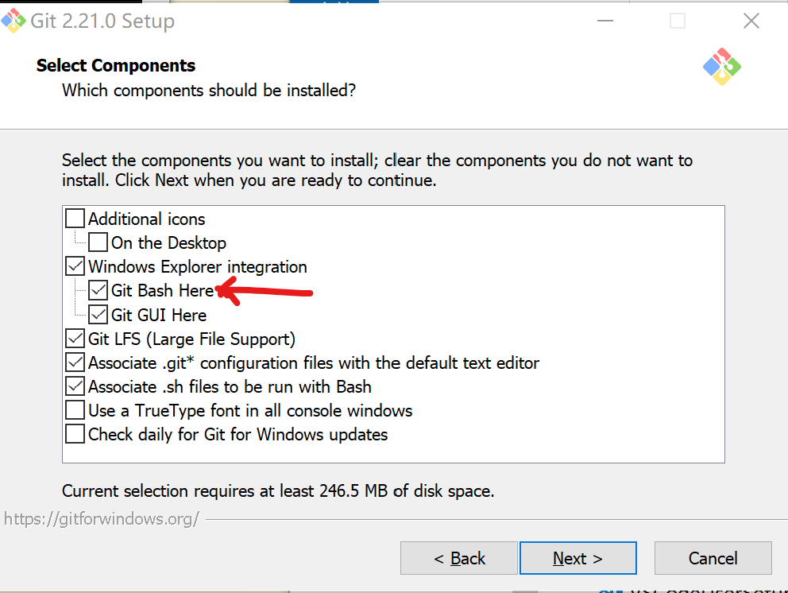
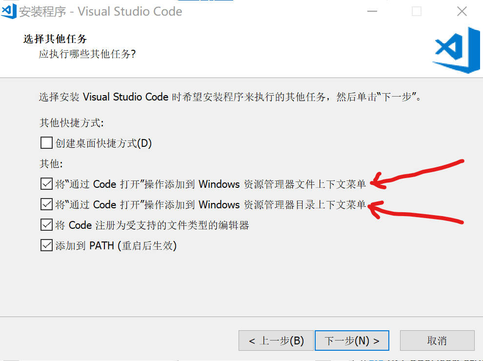
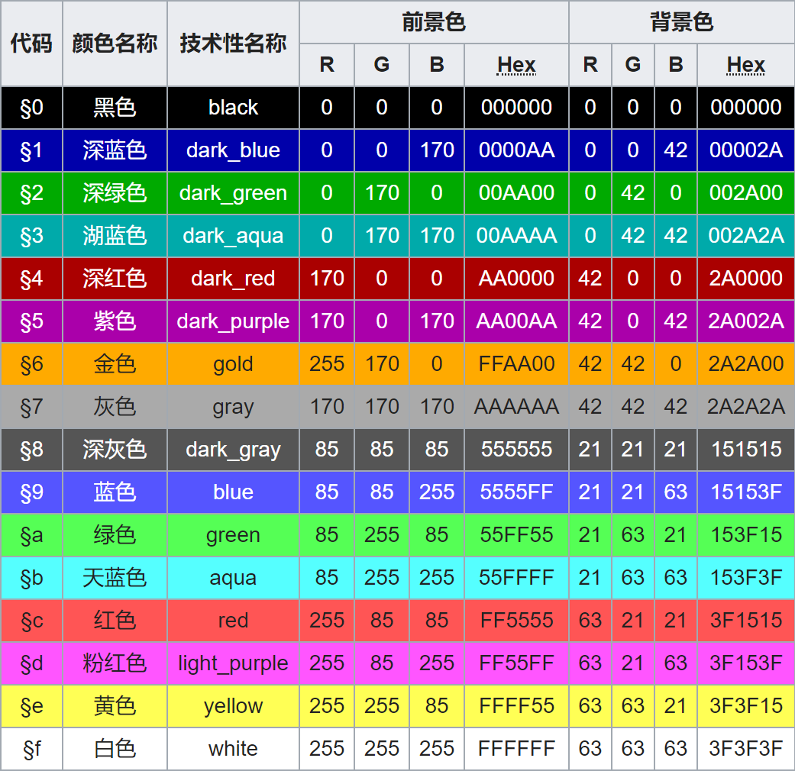

<!-- $theme: gaia -->
<!-- page_number: true -->

# Minecraft 小游戏之旅

---
<!-- *template: invert -->

# 课程目标

* 认识编程
* 学会编程
* 爱上编程

---

# 什么是编程

- ==**简单来说，就是使用计算机语言及一些辅助工具来实现一些能达到的目标**==

---

# 怎么学会它

- ==**那就由老师带领大家，一步一步地，从无到有地，实现至少两个Minecraft小游戏**==

---

# 怎样算爱上

- ==**当大家学完本课程后，明白了编程的思维模式，还能通过自己动手编写出一个独创的Minecraft小游戏，就是爱上它啦**==

---

# 准备工作

1. 在电脑桌面新建一个叫 **Mc入口** 的文件夹。然后，我们就准备安装软件了。要注意的是，安装各个软件的路径中，不要包含非英文字符或标点符号，否则软件可能跑不起来。

---

2. 注册下载并安装最新版本的 [Minecraft客户端](https://www.minecraft.net/zh-hans/)。安装完成后，打开 Minecraft客户端 后，选择 **1.11** 版本作为默认版本。再接着把 **Minecraft客户端** 的启动文件 **MinecraftLauncher** 新建一个快捷方式并重命名为 **启动客户端** ，然后把快捷方式文件移动至桌面文件夹 **Mc入口** 。

---

3. 下载并安装 [jdk1.8.0](https://www.oracle.com/technetwork/java/javase/downloads/jdk8-downloads-2133151.html)。安装完成后，需要配置环境变量。右键选择我的电脑 -> 属性 -> 高级系统设置 -> 环境变量。在 **系统变量** 栏下新建一个 JAVA_HOME 变量。值为安装 jdk 的目录（例如 `D:\myPrograms\jdk`），即 bin 文件夹所在目录。然后，再编辑 Path 变量，若系统是 win10，则添加 `%JAVA_HOME%\bin` 并置顶；若系统是 win7，则在值的开头添加`%JAVA_HOME%\bin;`。完成后，打开 cmd 窗口输入`java -version` 并回车，若窗口输出 Java 版本信息，则说明设置成功了。

---

4. 下载并安装 [Git](https://gitforwindows.org/)。需要注意的是，下面红色箭头指向的选项，一定要选上。否则，鼠标右键菜单就没有 **Git Bash Here** 项，会导致使用不便。



---

5. 声明：由于 **scriptcraft** 的新版本尚未完成，因此我们不能使用最新的 1.13 甚至 1.14 版本的 BuildTools 。而是使用与 **scriptcraft** 相匹配的 1.11 版本的 BuildTools 。
(1) 下载 [BuildTools](https://hub.spigotmc.org/jenkins/job/BuildTools/lastSuccessfulBuild/artifact/target/BuildTools.jar) 准备安装 Spigotmc。具体步骤可参考[BuildTools Wiki](https://www.spigotmc.org/wiki/buildtools/): 先在你的软件安装目录下新建一个 **Spigotmc** 文件夹，然后把 BuildTools.jar 文件放入其中。进入 **Spigotmc** 文件夹中。在空白处右击选择 **Git Bash Here** 打开 Git 窗口。输入命令 `java -jar BuildTools.jar --rev 1.11`，回车并等待即可。
---

【接上页】

(2) 当 BuildTools 安装完成后， 把 **start_server.bat** 文件也放入 **Spigotmc** 文件夹中。双击 **start_server.bat** 运行，则会在 **Spigotmc** 文件夹中生成 **eula.txt** 等文件。打开刚生成的 **eula.txt** 文件，将其中的 `eula=false` 改成 `eula=true` ，否则我们无法真正启动服务器。
(3)然后，右击该 **start_server.bat** 文件，发送快捷方式到桌面。然后把桌面的此快捷方式重命名为 **启动服务器** 放入到 **Mc入口** 目录中。
(4) 这个时候，我们已经可以启动服务器并进行多玩家的游戏了。但是，我们尚不能使用JavaScript来做一些有趣的事情。

---

6. 为了在 Spigotmc 中使用 JavaScript ，我们需要先下载一个插件包 [scriptcraft.jar](https://www.scriptcraftjs.org/) 。然后把该插件包放入到 `Spigotmc > plugins` 中。重启服务器后，在命令行窗口中输入 `js 1 + 1`，如果输出了数字 **2**，则说明插件安装成功啦。
===
这时候，在 **Spigotmc** 目录中会生成一个叫 **scriptcraft** 的文件夹，以后，我们的一切操作，都会基于该文件夹的内容。右击选择 **scriptcraft** 目录，然后发送快捷方式到桌面并重命名其为 **脚本入口** ，然后再把该快捷方式放入 **Mc入口** 目录中。

---

7. 为了方便编写代码，我们需要下载并安装 [Vscode](https://code.visualstudio.com/)。需要注意的是，下面红色箭头指向的选项，一定要选上。否则，鼠标右键菜单就没有相应的 **Open with Code** 选项，会导致使用不便。



---

8. **JtLkaKill** 用于终止伽卡学生端。该软件不用安装，直接重命名为 **终止伽卡** 放置于 **Mc入口** 文件夹中即可

---

9. 安装 **伽卡他卡电子教室学生端** ，用于被老师控屏。课程结束后，可打开 **JtLkaKill** 终止伽卡，然后把整个伽卡安装的目录删除即可。


到此，我们已经安装了所有必需的软件和插件。

---

# 如何实现Minecraft小游戏

### 1. 编辑地图

我们使用 [WorldEdit](https://dev.bukkit.org/projects/worldedit) 插件来实现[游戏场地的构建](http://mineplugin.org/WorldEdit)

### 2. 编写代码

我们使用 [JavaScript](https://developer.mozilla.org/zh-CN/docs/Web/JavaScript)(后面统一叫 Js) 脚本来实现游戏的逻辑

---

# 让我们一点一滴地积累 Js 基础

---

# 变量

> 变量是存储数据(值)的容器

<small style="font-size: .8em;">在 plugins 文件夹中，我们新建一个 test_variable.js 文件，然后敲下以下代码</small>
```javascript
exports.test_variable = function() {
  var name = 'Echo';
  
  server.broadcastMessage('Hello, ' + name);
}
```

---

# [数据类型](https://developer.mozilla.org/zh-CN/docs/Web/JavaScript/Data_structures)

> 数据，是可以有不同类型的。要检测一个变量的值的类型，可以用 `typeof` 运算符

```javascript
var a = true;	// 这是布尔类型，对应的值有 true 和 false
var b = null;	// 这是空类型，对应的值只有 null
var c = undefined; // 这是未定义类型，指只声明而未赋值的变量
var d = 1;	// 这是数字类型，在js中，整数和小数都是数字类型
var e = 'Echo';	// 这是字符串类型，用单引号或双引号括起来
var f = {	// 这是复合类型之一：对象。
  o: false,
  p: 2,
  q: "str",
};
var g = [3, 'hello', true];	// 这是复合类型之一：数组
```

---

# 注释

> 注释是为了使代码的作用一目了然，是给人看的

<small style="font-size: .8em;">在前一个文件中，我们为代码加入一些注释</small>
```javascript
/**
 * 这个函数的作用是为了输出一些文字
 */
exports.test_variable = function() {
  var name = 'Echo';
  
  // 在这里调用系统函数进行文字输出
  server.broadcastMessage('Hello, ' + name);
}
```

---

# [运算符](https://developer.mozilla.org/zh-CN/docs/Web/JavaScript/Reference/Operators)

> 计算机诞生的目的，就是为了进行数学运算

<small style="font-size: .8em;">我们练习一下以后可能会用到的运算。新建一个 test_operator.js 文件，键入以下代码</small>
```javascript
/**
 * 这个函数的作用是为了输出一些文字
 */
 
exports.test_operator = function() {
  var number1 = 1;
  var number2 = 2;
  // 在这里，可以把 + 号分别替换成 *、/、- 等
  var result = number1 + number2;
  server.broadcastMessage(result);
}
```

---

【接上一页】

那么，都有哪些[运算符](https://developer.mozilla.org/zh-CN/docs/Web/JavaScript/Reference/Operators)呢？

---

**算术运算符**
| + | - | * | / | % |
|---|---|---|---|---|  -
| 加 | 减 | 乘 | 除 | 求余 |

===

| 表达式 | 结果|
|---|---|
| 1 + 2 | 3 |
| 3 - 1 | 2 |
| 2 * 3 | 6 |
| 6 / 3 | 2 |
| 5 % 3 | 2 |

---

**赋值运算符**
| += | -= | *= | /= |
|---|---|---|---|
| 加等 | 减等 | 乘等 | 除等 |

===
假设 `num = 10;`
| 语句 | num的运算结果 | 等效于 |
|---|---|---|
| num += 2 | 12 | num = num + 2 |
| num -= 2 | 8 | num = num - 2 |
| num *= 2 | 20 | num = num * 2 |
| num /= 2 | 5 | num = num / 2 |

---

**单操作数运算符**
| ++ | -- |
|---|---|
| 自增 | 自减 |

===
假设 `num = 10;`
| 语句 | num的运算结果 | 等效于 |
|---|---|---|
| num++ | 11 | num = num + 1 |
| num-- | 9 | num = num - 1 |

---

**逻辑运算符**
| && | \|\| | ! |
|---|---|---|
| 与 | 或 | 非 |

===

| 表达式 | 结果| # | 表达式 | 结果| # | 表达式 | 结果|
|---|---|---|---|---|---|---|---|
| 0 && 0 | 0 | | 0 \|\| 0 | 0 | | !true | false |
| 0 && 1 | 0 | | 0 \|\| 1 | 1 | | !false | true |
| 1 && 0 | 0 | | 1 \|\| 0 | 1 | | | |
| 1 && 1 | 1 | | 1 \|\| 1 | 1 | | | |
---

# 语句
> 语句，是 Js 运行的基础。通常，简单语句都会以分号 `;` 简单结尾。语句也可以省略分号，但不建议这么做。 
 
简单语句示例：
```javascript
// 声明和赋值语句
var name = 10;

// 函数执行语句
echo('Hello World');

// 自加运算语句
num++;
```

---

除了简单语句，Js 中也存在着大量的复合语句。例如**流程控制**语句。

流程控制只要分三大类，类别如下：


---

**顺序语句**，顾名思义，就是按照从上往下、从左往右顺序执行的语句。
在 plugins 目录下新建一个 test_order.js 文件，然后键入以下代码。保存后，在控制台中执行 `reload` 命令，然后再执行 `/js test_order(self)` 。

```javascript
var Blocks = require('blocks');
var Drone = require('drone');
exports.test_order = function(player) {
  var loc = player.location;
  var drone = new Drone(loc);
  // drone 将会按照顺序创造出 石头、铁、黄金 方块
  drone.fwd(1);
  drone.box(Blocks.stone);
  drone.fwd(1);
  drone.box(Blocks.iron);
  drone.fwd(1);
  drone.box(Blocks.gold);
}
```

---

**分支语句**，即需要先判断条件，再决定执行哪个操作。

分支有两种形式：`if...else` 和 `switch`。其中，`if...else` 主要用于判断逻辑条件；`switch` 主要用于判断计算条件。

---

先来看一下 `if...else` 的用法。

在 plugins 目录下新建一个 test_if_else.js 文件，然后键入以下代码。保存后，在控制台中执行 `reload` 命令，然后再执行 `/js test_if_else(self)` 。

```javascript
exports.test_if_else = function(player) {
  var name = player.name;
  
  if (name.length % 2 === 0) {
    echo(player, 'even');
  } else {
  	echo(player, 'odd')
  }
}
```

---

接着，我们看一下 `switch` 的用法

在 plugins 目录下新建一个 test_switch.js 文件。

```javascript
exports.test_switch = function(num) {
  switch (num) {
    case 1:
    	server.broadcastMessage('One'.red());
    	break;
    case 2:
    	server.broadcastMessage('Two'.blue());
    	break;
    case 3:
    	server.broadcastMessage('Three'.green());
    	break;
    default:
    	server.broadcastMessage('Other');
  }
}
```

---

刚才，我们从字符串中使用了颜色方法，从而让文字变得绚丽多彩。那么，Minecraft 都支持哪些颜色呢？



---

继续回到我们的主题。接下来，我们讲一下在任何一门语言中，都是最重要的部分：**循环语句** 

几乎所有的语言，都包括三种类型的循环：`for`、`while`、`do...while`。

它们的区别在哪呢？

---

`for` 用于次数确定的循环。比如，你想生成10只小鸡。

```javascript
var world = server.worlds.get(0);
var entityType = org.bukkit.entity.EntityType.CHICKEN;

exports.test_for = function(player) {
  var loc = player.location;
  
  for (var i = 0; i < 10; i++) {
  	world.spawnEntity(loc, entityType);
  }
}
```

---

`while` 用于判断特定条件的循环。比如，你希望眼前的平地上，同时点着一列炸弹。

在 plugins 目录下新建一个 test_while.js 文件，然后键入以下代码。保存后，在控制台中执行 `reload` 命令，然后再执行 `/js test_while(self)` 。

代码在下一页。

---

```javascript
var Blocks = require('blocks');
var Drone = require('drone');

exports.test_while = function(player) {
    var loc = player.location;
    var drone = new Drone(loc);

    drone.fwd(3);       // 在离自己3格远的地方开始

    while (drone.getBlock().type + '' === 'AIR' && 
    drone.down().getBlock().type + '' !== 'AIR') {    
        drone.up();     // 先上移一格，恢复至原来的位置

        drone.box(Blocks.tnt);  // 放置tnt
        drone.left();          // 然后左移一格
        drone.box(Blocks.fire); // 放火

        drone.right();  // 右移一格，恢复列的位置
        drone.fwd(1);   // 然后，前进一格
    }
}
```

---